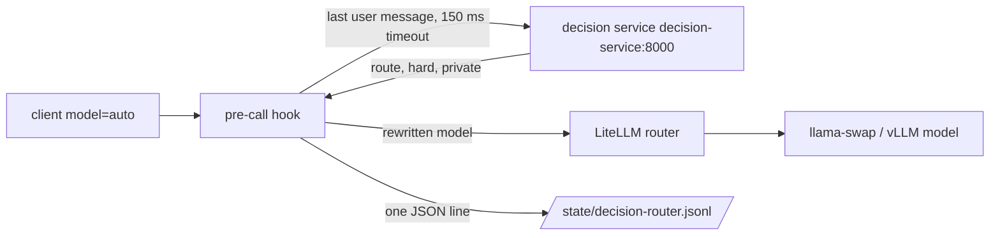

# Decision router for the virtual model `auto`

Status: prototype with simulated-response tests. **Off by default.**
Enabling it changes the host gateway file (`GATEWAY_CONFIG`) and the host override file
`.local/compose.host.yaml` (see `docs/host-configuration.md`). Enable it only when you need automatic model selection.
The router calls the decision service, a service of the host. `config/decision-routes.example.yaml` is an example with generic
model names. A host that enables the router copies it to `.local/config/decision-routes.yaml` and sets its own model names.

## What it does

A client sends `"model": "auto"` to `/v1/chat/completions`. A LiteLLM pre-call hook
(`image/routers/decision_router.py`) sends the end of the last user message to the decision service with three questions:

| Question | Type | Use |
|---|---|---|
| `route` | `choice`: coder, vision, chat, long_context | selects the route row |
| `hard` | `noul` | splits easy and hard coder or chat requests |
| `private` | `noul` | blocks remote models for private text |

The hook then sets `model` from the table in the routes file (`DECISION_ROUTES`, see `config/decision-routes.example.yaml`). The table, the thresholds
and the question text are in that file, not in code. Requests for any other model are not touched.



## Rules, in order

1. The message has an image part: `image_model`. No decision call.
2. The decision service times out (150 ms) or fails: `default_model`.
3. Route confidence below `min_confidence` (0.5): `default_model`, and the log line has `review: true`.
   Test the threshold with representative requests before use. Confidence scores do not prove routing accuracy.
   Observed with one decision service on nine test prompts: the two wrong routes had confidence 0.35 and 0.45, and the seven right ones 0.85 or more.
   Not verified: this split for other services.
4. Otherwise the first matching row of `routes`.
5. `private >= 0.5` and the chosen model starts with `openrouter/`, `codex1/`, `codex2/` or `codex-auto/`: `private.local_model`.

The current route table maps only to local models, so rule 5 is a guard for later edits.

Warning: rule 5 is a probability check, not a proof. The decision service can score private text below the threshold.
Do not map `auto` to a remote model for sensitive work; use a local-only key for that.

## Decision log

`/state/decision-router.jsonl`, one line per request: time, model, reason, route, confidence, `hard`, `private`,
hook overhead, a SHA-256 prefix of the text, and `review`. A 300-character excerpt is stored only when `private < 0.5`.
Use the log to relabel prompts and to check routing with real cases.

## Verification limits

Overhead of the hook: one call to the decision service, with a 150 ms timeout.
With a decision service on the same host, the added latency was about 36 ms at p50.
Not verified for other services.

`tests/test_decision_router.py` uses simulated responses to check model selection, fallback, privacy handling and logging.
These tests do not measure the accuracy or latency of your decision service.
Not verified: routing accuracy and added latency for your service, route table and workload.

A decision service can choose an incorrect route or underestimate request difficulty.
Check routing decisions with representative requests before you enable the hook.
Embedding requests use `/v1/embeddings`, not chat, so `embed` is not a route here.

## How to enable

1. Mount the two files in the `gateway` service of `.local/compose.host.yaml`. Compose adds these
   volumes to the volumes of `compose.yaml`. The gateway must also join the network of the decision service, for example `proxy`.

   ```yaml
   services:
     gateway:
       volumes:
         - ./image/routers/decision_router.py:/config/decision_router.py:ro
         - ./.local/config/decision-routes.yaml:/config/decision-routes.yaml:ro
         - ./state/decision-router:/state
       environment:
         DECISION_ROUTES: /config/decision-routes.yaml
         DECISION_ROUTER_ENABLED: "1"   # 0, false, off, or no: skip decision calls
   ```

2. In the host gateway file, add an `auto` entry to `model_list` with the `litellm_params` of `default_model`
   (so `auto` still works when the hook is off), and add the callback:

   ```json
   "litellm_settings": {"callbacks": ["decision_router.proxy_handler_instance"], ...}
   ```

3. `mkdir -p state/decision-router && chown 1000:1000 state/decision-router`, then `docker compose up -d gateway`.
4. Check: `curl` with `"model": "auto"`, then read the last line of `state/decision-router/decision-router.jsonl`.

To disable: remove the callback line and recreate the gateway. Requests for `auto` then go to the default model.

## Choose the service and models

- Compare routing accuracy and latency with representative requests when you select a decision service.
- Set each route to a model that your gateway exposes. The example `long_context` row uses `local/general-model`.
- The privacy guard applies only to `auto` with call type `completion` or `acompletion`.
  Requests that name a remote model directly and requests of other call types bypass the guard.
  To guard requests that name a remote model, the hook must call the decision service for each request.
  This adds the overhead above.

## Switch

`DECISION_ROUTER_ENABLED` turns the decision call on or off. Unset means on.
With `0`, `false`, `off`, or `no`, a request for `auto` goes to `default_model` with no call to the decision service.
The log records the reason `router_disabled`.
The hook reads the value on each request. A change in a Compose file or `.env` needs `docker compose up -d gateway` (recreate), not a restart.

